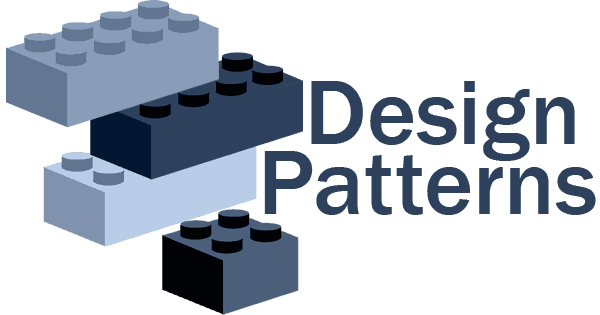

# Advanced OOP Piscine - Module 04 (Design Patterns)



## About

this is the fifth module of the advanced OOP piscine, it's about design patterns.
Here is the link to the [subject](https://cdn.intra.42.fr/pdf/pdf/101072/en.subject.pdf)

## Installation && Usage

1. Clone the repository to your local machine:

   ```bash
   git clone git@github.com:Stilram19/pescine-object-module04-DesignPatterns.git
   ```

2. Navigate to the repository's directory:

    ```bash
    cd pescine-object-module04-DesignPatterns
    ```

3. Choose an exercise, Compile and Run the program:

   ``` bash
   cd ex00/ && make run
   ```

### Factory Design Pattern

- **Simplification**:  
  In this example, there is no need to create a Factory interface or abstract class since there is only one client (the main function). This client can directly instantiate objects from concrete products.

- **Consideration for Abstraction**:  
  In cases where there is at least one client that doesn't need to know about the concrete Factory, abstraction should be considered.

- **Issue with Parameters**:  
  The Factory cannot supply parameters to the concrete commands. Therefore, parameters need to be injected through setters. Since these setters are not part of the Command Interface contract and are crucial for executing the concrete commands, using the Interface and Factory becomes redundant. The Factory returns a pointer to the Command Interface, which cannot be used to supply parameters for each concrete command.

- **Proposed Solution**:  
  Using `dynamic_cast` to cast the Form into its subtypes solves this problem. The Factory will encapsulate the object creation logic and return a `Form*`, which is then cast to the appropriate concrete form. Parameters can be supplied accordingly and signed by the headmaster.

### Forward Declaration and Decoupling

- **Forward Declaration**:  
  Using forward declarations as much as possible and separating the declaration and definition of a class greatly aids in decoupling modules.


## Find Other Modules:
- [Module-00-Encapsulation](https://github.com/Stilram19/pescine-object-module00-encapsulation)
- [Module-01-Relationships](https://github.com/Stilram19/pescine-object-module01-Relationship)
- [Module-02-UML](https://github.com/Stilram19/pescine-object-module02-UML)
- [Module-03-SOLID](https://github.com/Stilram19/pescine-object-module03-SOLID)
- [Module-04-Design Patterns](https://github.com/Stilram19/pescine-object-module04-DesignPatterns)
